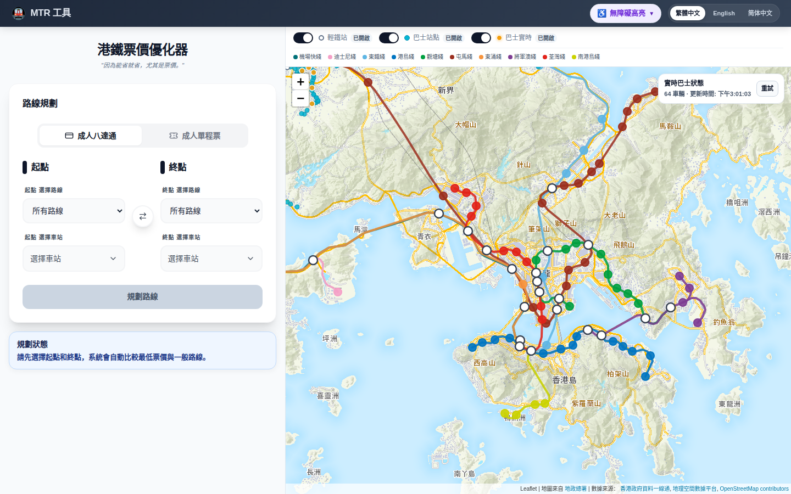
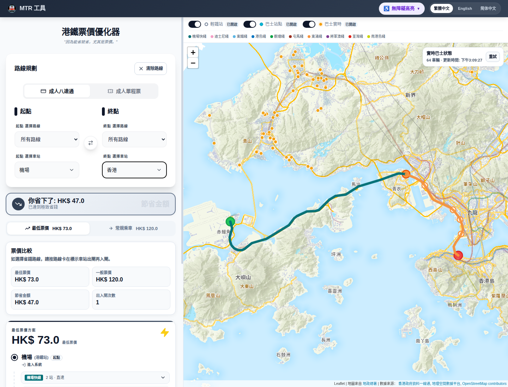
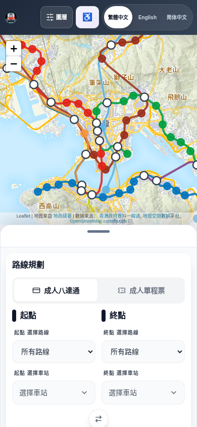
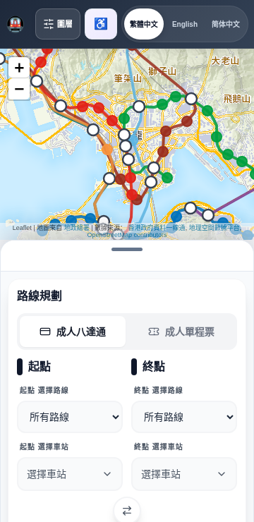

# HCI 课程 10 分钟汇报 Slides 草稿

Last updated: 2026-06-14

本文档用于制作 10 分钟 HCI 课程汇报 slides。结构按成员集中组织：全组开场后，李堂辉集中讲项目背景与路由算法，高胜寒集中讲界面设计、移动端适配与线路显示，组员 X 集中讲周边旅游推荐，组员 Y 集中讲用户关怀与无障碍，最后全组总结。

## 已有截图

以下截图已生成在 `docs/slides/screenshots/`，可以直接插入 slides：



用途：整体系统界面、真实地图底图、线路与图层显示。



用途：路径规划正确性案例。截图使用“机场 -> 香港”，展示系统给出的省钱路径：机场快线到青衣后出闸再入闸，再走东涌线到香港。最低票价 HK$73.0，常规乘车 HK$120.0，节省 HK$47.0。



用途：移动端地图优先布局、底部路线规划面板。



用途：360px 窄屏下的布局适配证明。

仍建议补拍：

- 无障碍筛选面板展开截图。
- 车站弹窗中的无障碍设施详情截图。
- 周边旅游推荐完成后的界面截图或设计稿。
- 用户调研结果图表。

## 10 分钟时间分配

| 段落 | 负责人 | 页数 | 建议用时 |
| --- | --- | --- | --- |
| 开场：问题、目标、分工 | 全组 | 3 页 | 1 分 20 秒 |
| 主要功能：背景与路由算法 | 李堂辉 | 3 页 | 2 分 10 秒 |
| 界面设计：移动端适配、线路显示 | 高胜寒 | 4 页 | 3 分 10 秒 |
| 周边旅游推荐 | 组员 X | 1 页 | 50 秒 |
| 用户关怀：无障碍与调研 | 组员 Y | 1 页 | 1 分 20 秒 |
| 总结与后续计划 | 全组 | 1 页 | 1 分 10 秒 |

合计约 10 分钟。排练时每页不要逐字读，slides 放关键词，讲稿由每位成员自己熟悉。

## Slide 1：封面

负责人：全组
建议用时：20 秒

建议标题：

- 港铁票价优化器与综合交通交互系统
- MTR Fare Optimizer & Transit Interface

画面安排：

- 使用 `slides/screenshots/desktop-map-overview.png` 作为主视觉。
- 标出课程：人机交互导论大作业。
- 放组员姓名和一句话分工。

正文要点：

- 基于真实开放数据。
- 面向香港港铁出行。
- 目标是把票价优化、路线规划、地图展示、无障碍信息和周边推荐整合起来。

讲稿提示：

> 我们做的是一个港铁出行辅助系统。它不是单纯查票价，也不是只看地图，而是帮助用户理解路线、票价、换乘和车站信息。

## Slide 2：问题背景：为什么需要这个系统

负责人：全组或李堂辉
建议用时：35 秒

画面安排：

- 左侧放 3 个痛点。
- 右侧放 `desktop-map-overview.png` 的地图区域裁剪，展示香港交通网络复杂度。

正文要点：

- 香港交通网络复杂：重铁、机场快线、轻铁、港铁巴士同时存在。
- 最直观路线不一定最便宜，用户很难自己判断是否有省钱方案。
- 出行决策不只看路线，还要看地图、换乘、无障碍设施和到站后的周边信息。

讲稿提示：

> 传统路线查询通常只告诉用户怎么坐，但用户真正需要的是理解为什么这样走、花多少钱、是否适合自己的出行条件。

## Slide 3：项目目标与分工

负责人：全组
建议用时：25 秒

画面安排：

- 用四个并列模块展示成员分工。

正文要点：

| 成员 | 负责方向 | 汇报重点 | 当前状态 |
| --- | --- | --- | --- |
| 李堂辉 | 项目背景、路由算法 | 数据如何建模，路线和票价如何算 | 主体完成 |
| 高胜寒 | 界面设计、移动端适配、线路显示 | 用户如何看懂和操作 | 主体完成 |
| 组员 X | 周边旅游推荐 | 站点周边景点、美食推荐 | 待补，老师明确要求 |
| 组员 Y | 用户关怀 | 无障碍设施信息、用户体验调研 | 无障碍基本完成，调研待补 |

讲稿提示：

> 下面按这个分工集中介绍，每个人的部分连续讲完，避免内容打散。

## 李堂辉部分：主要功能、项目背景与路由算法

### Slide 4：数据基础与统一交通网络

负责人：李堂辉
建议用时：45 秒

画面安排：

- 左侧列数据来源。
- 右侧画流程图。

正文要点：

- 数据来自香港政府和港铁开放数据。
- 覆盖港铁线路、站点、票价矩阵、机场快线、轻铁、港铁巴士、无障碍设施。
- 将不同交通方式统一抽象成图结构。
- 节点是站点或换乘点，边是线路相邻站、换乘关系、出闸再入闸、接驳关系。

建议流程图：

```text
开放数据
  -> 清洗站点 / 线路 / 票价
  -> 构建统一交通图
  -> 路径搜索与票价比较
  -> 路线卡片与地图高亮
```

讲稿提示：

> 我们不是手写几个演示路线，而是用真实数据构建可计算的交通网络。这样系统才能支持跨港铁、机场快线、轻铁和巴士的路线规划。

### Slide 5：路由算法与票价优化逻辑

负责人：李堂辉
建议用时：45 秒

画面安排：

- 用输入、计算、输出三栏表示。

正文要点：

- 输入：起点、终点、票种。
- 计算：在统一交通图上搜索普通路线和最低票价路线。
- 优化目标不只是距离，还包括票价、换乘、乘坐区间和出入闸段落。
- 输出：总票价、分段路线、线路名、站点序列、出入闸说明。

讲稿提示：

> HCI 里算法不能只返回一个数字。用户需要知道这条路线为什么省钱、在哪里换乘、哪里需要出闸再入闸，所以我们把算法结果拆成可读的分段路线。

### Slide 6：正确性案例：机场 -> 香港

负责人：李堂辉
建议用时：40 秒

画面安排：

- 使用 `slides/screenshots/route-result-desktop.png`。
- 框出节省金额、票价比较和地图路径。

正文要点：

- 查询：机场 -> 香港。
- 常规乘车：HK$120.0。
- 最低票价：HK$73.0。
- 节省：HK$47.0。
- 正确性体现：系统没有简单推荐机场快线直达，而是识别出“机场快线到青衣后出闸再入闸，再坐东涌线到香港”的更优方案。

讲稿提示：

> 这个案例最能说明路径规划是有效的。机场到香港直达很自然，但不一定最便宜；系统找到了青衣分段方案，并把出闸再入闸明确展示出来。

## 高胜寒部分：界面设计、移动端适配与线路显示

### Slide 7：桌面端界面：规划与地图并列

负责人：高胜寒
建议用时：45 秒

画面安排：

- 使用 `slides/screenshots/desktop-map-overview.png`。
- 在截图上标注左侧路线规划面板、右侧地图、顶部图层/语言/无障碍入口。

正文要点：

- 桌面端采用左侧规划面板 + 右侧地图。
- 左侧负责输入和状态：票种、起点、终点、规划状态。
- 右侧负责空间理解：线路、站点、轻铁、巴士站、实时巴士。
- 用户不需要切换页面，就能同时看到输入、地图和后续结果。

讲稿提示：

> 我负责把算法和数据结果变成用户能操作的界面。桌面端的关键是让路线规划和地图并列出现，因为用户理解路线时一定需要空间上下文。

### Slide 8：路线结果展示：让用户看懂为什么省钱

负责人：高胜寒
建议用时：55 秒

画面安排：

- 使用 `slides/screenshots/route-result-desktop.png`。
- 标注左侧的节省金额、票价比较、路线卡片。
- 标注右侧地图中的路线高亮、起点、出闸再入闸点、终点。

正文要点：

- 路线结果展示最低票价、常规票价、节省金额和出入闸次数。
- 路线卡片按段落展示，每段包含线路、站点数和站点序列。
- 地图同步高亮路线，弱化无关站点。
- 机场 -> 香港案例中，用户能同时看到“省了多少钱”和“具体怎么走”。

讲稿提示：

> 这一页是界面部分的重点。系统不是只告诉用户 HK$73，而是告诉用户在哪里出闸、在哪里再入闸、路线在地图上怎么走。这样算法结果才真正变成可执行的出行说明。

### Slide 9：线路显示与地图图层

负责人：高胜寒
建议用时：40 秒

画面安排：

- 使用 `desktop-map-overview.png` 的地图区域。
- 标注不同线路颜色、轻铁站、巴士站、实时巴士车辆。

正文要点：

- 地图使用真实底图和真实站点坐标。
- 不同线路使用对应颜色，降低复杂网络的识别成本。
- 港铁、轻铁、巴士站和实时巴士使用不同视觉标记。
- 图层开关让用户按需要隐藏信息，减少视觉负担。

讲稿提示：

> 地图不是装饰，而是路线理解工具。颜色、站点样式和图层开关都是为了帮助用户从复杂网络里找到当前关注的信息。

### Slide 10：移动端适配：地图优先 + 底部面板

负责人：高胜寒
建议用时：50 秒

画面安排：

- 并排放 `slides/screenshots/mobile-overview.png` 和 `slides/screenshots/mobile-narrow.png`。
- 标注顶部按钮、地图区域、底部路线规划面板和拖拽把手。

正文要点：

- 移动端首屏以地图为主，符合出行场景中的方向感需求。
- 路线规划表单放入底部面板，避免地图被表单挤掉。
- 底部面板支持展开、收起和拖拽。
- 针对 390px 和 360px 窄屏处理按钮、表单、地图之间的遮挡问题。
- 多语言文案覆盖主要界面、路线结果、地图图层和无障碍入口。

讲稿提示：

> 移动端不是把桌面版缩小，而是重新排序任务优先级：先看地图，再展开底部面板操作。这样用户在路上使用时不会被表单挡住全部地图。

## 组员 X 部分：周边旅游推荐

### Slide 11：站点周边景点与美食推荐

负责人：组员 X
建议用时：50 秒

当前状态：待补，老师明确要求。

画面安排：

- 如果功能完成：放车站弹窗或路线终点附近的推荐模块截图。
- 如果功能未完成：放设计草图，明确标注为“计划功能”。

正文要点：

- 当前系统解决“怎么去”和“多少钱”。
- 周边旅游推荐补充“到了之后做什么”。
- 推荐内容包括景点、美食、商圈。
- 推荐字段建议包含名称、类型、简介、距离/步行时间、推荐理由。
- 优先覆盖游客高频站点：香港、中环、尖沙咀、旺角、铜锣湾、金钟、九龙、迪士尼、东涌、机场。

讲稿提示：

> 这一部分目前不能说已经完成。可以说明这是老师要求补充的场景扩展：用户规划路线到香港站后，系统继续推荐中环附近可以去哪里、吃什么，让工具从交通查询扩展到完整出行辅助。

## 组员 Y 部分：用户关怀、无障碍设施与用户体验调研

### Slide 12：无障碍设施与用户体验调研

负责人：组员 Y
建议用时：1 分 20 秒

画面安排：

- 左侧：无障碍设施信息和筛选入口。
- 右侧：用户调研计划表。
- 后续应补无障碍筛选展开截图和车站弹窗截图。

正文要点：

- 目标用户不只包括普通通勤者，也包括轮椅使用者、老人、携带行李者、听觉/视觉障碍用户、游客。
- 无障碍设施信息已基本完成：整合车站设施数据，支持在车站详情中查看。
- 无障碍筛选支持按设施条件高亮符合条件的车站。
- 筛选只影响地图高亮，不改变路线计算，避免用户误解系统行为。
- 用户体验调研仍需补充：
  - 任务：规划机场到香港、解释省钱原因、查看地图路线、筛选无障碍车站、移动端展开面板。
  - 指标：完成时间、错误次数、是否理解路线、是否理解出闸再入闸、主观满意度。

讲稿提示：

> 这一页要体现 HCI 的用户关怀。无障碍用户关心的不是“有没有路线”，而是这条路线和车站是否真的适合自己。调研目前还没完成，最终汇报前应该补问卷或访谈结果。

## 全组总结

### Slide 13：完成度与后续计划

负责人：全组
建议用时：1 分 10 秒

画面安排：

- 左侧放“已完成”。
- 右侧放“待完成”。
- 下方放 4 张证据缩略图：桌面地图、路径规划、移动端、窄屏移动端。

正文要点：

已完成：

- 基于真实开放数据的交通网络。
- 路径规划与票价比较。
- 机场 -> 香港省钱路线案例。
- 桌面端路线规划与地图联动。
- 移动端适配和底部面板。
- 线路显示、地图图层、路线高亮。
- 无障碍设施信息基础能力。

待完成：

- 周边旅游推荐功能。
- 用户体验调研结果。
- 无障碍筛选和车站详情截图补拍。
- 最终 slides 视觉排版。

讲稿提示：

> 总结时要诚实区分完成和未完成。项目目前已经有可运行系统和可解释案例，后续重点是补齐老师要求的旅游推荐，以及 HCI 汇报需要的用户调研证据。

## 10 分钟排练口径

- Slide 1-3：不要展开技术细节，只把问题、目标、分工讲清楚。
- 李堂辉部分：重点讲“真实数据 -> 图建模 -> 票价优化 -> 机场到香港案例”，不要陷入代码实现。
- 高胜寒部分：重点讲“用户如何看懂路线”，用截图解释桌面端、路线结果、地图高亮、移动端。
- 组员 X 部分：明确这是待补功能，但要讲清为什么老师要求它，以及准备怎么做。
- 组员 Y 部分：无障碍要讲“用户差异”，调研要讲“任务和指标”，不要只说会发问卷。
- 总结页必须收束到 HCI：正确性、可理解性、移动可用性、用户关怀。

## 验证说明

- 本文档引用的截图均来自本地运行页面。
- `route-result-desktop.png` 已更新为“机场 -> 香港”的路径规划结果截图。
- 本次只修改文档，没有修改业务代码。
- 未运行 `npm run test`、`npm run lint`、`npm run build`，因为本次没有改动业务逻辑。
